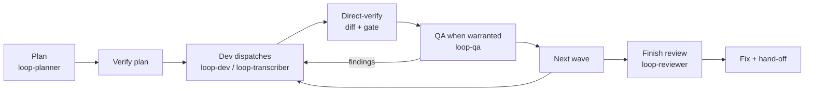

# subagent-loop

An orchestrator–judge loop for [Claude Code](https://docs.claude.com/en/docs/claude-code/overview).
Subagent developers implement, adversarial subagent reviewers try to break the work, and the
orchestrator only judges: it never edits project files itself.

One skill and five agents. Every rule in them traces back to a failure logged in a real run.

## Why

Long agentic coding sessions tend to fail in the same ways:

- The agent that writes the code also grades it.
- Self-reports ("tests pass", "verified") are accepted as evidence.
- Parallel work collides on shared files.
- "One more fix round" never ends.

subagent-loop separates those roles and turns every claim into something the orchestrator checks.

## How it works



Your main Claude Code session is the orchestrator. It runs the two verify steps itself; everything
that changes the project is a subagent dispatch.

- **The judge never authors.** Not a one-line fix, not a change QA already wrote out. An orchestrator
  edit is unreviewed code written by the judge.
- **Reports are claims.** Before any QA, the orchestrator reads the diff and reruns the gate itself.
- **The plan is a claim too.** The wave table is checked mechanically before any dispatch: same-wave
  file sets are disjoint, every dependency points to an earlier wave.
- **Parallel by construction.** The planner designs waves of tasks with disjoint file sets. The
  orchestrator dispatches every ready task, starting with 2 in flight and adding one after each wave
  without a rate-limit failure, up to 4.
- **Brakes that never soften.** The loop stops on 3 QA rejections of one task, a BLOCKED report the
  brief can't resolve, a gate red twice in a row on one task, a rate-limit failure, an exhausted budget, or
  anything that contradicts a decision the project recorded as final.
- **Commits only when you ask**, with explicit paths — never `git add -A`.

### The agents

| Agent | Default model | Job | Edits the project? |
| --- | --- | --- | --- |
| `loop-planner` | fable, max effort | Writes or re-plans the wave table | No — only the plan file |
| `loop-dev` | sonnet | Implements one task that needs judgment | Yes |
| `loop-transcriber` | haiku | Applies a fully specified brief; reports BLOCKED instead of improvising | Yes |
| `loop-qa` | sonnet | Adversarial review of one task | No Edit tool; writes only its findings file |
| `loop-reviewer` | opus | Whole-branch Finish review, plan included | No Edit tool; writes only its findings file |

## Usage

```
/subagent-loop [plan] [auto] [goal "<end condition>" budget=<N dispatches>]
```

| Command | Plan comes from | Between phases | Stops when |
| --- | --- | --- | --- |
| `/subagent-loop` | Your approved plan | Waits for you | Plan complete |
| `/subagent-loop plan` | `loop-planner`, after an interview and your approval | Waits for you | Plan complete |
| `/subagent-loop plan auto` | `loop-planner`, after your approval | Continues; brakes still apply | Plan complete |
| `/subagent-loop goal "…" budget=N` | `loop-planner`; re-plans when the plan runs out | Continues; brakes still apply | Goal met, a brake, or N dispatches |

The loop sizes itself to the plan:

| Tier | Plan | How review is spent |
| --- | --- | --- |
| S | ≤3 tasks, one phase | Orchestrator verification per task, one Finish review. A fully specified ≤3-file change becomes a single dev dispatch. |
| M | 4–5 tasks, one phase | Per-task QA where the task touches logic or shared state, plus the Finish review |
| L | 6+ tasks, several phases, or new systems | The full loop: waves, per-task QA, phase gates (or brakes in `auto`) |

## Install

User-level (all projects):

```bash
mkdir -p ~/.claude/skills ~/.claude/agents
cp -r skills/subagent-loop ~/.claude/skills/
cp agents/loop-*.md ~/.claude/agents/
```

Project-level (one repo): the same three commands with `<repo>/.claude/` instead of `~/.claude/`.

Don't rename the agent files or their `name:` frontmatter. The skill dispatches them by exact name.

`loop-planner` is pinned to `model: fable`. On an account without Fable, change that line to
`model: opus`.

## Setup: the verification contract

The loop needs to know how your project verifies work. At setup it reads your `CLAUDE.md` and the
files it points to. If it finds nothing, it asks once and records the answers in the ledger.
For example, in `CLAUDE.md`:

```markdown
## Verification contract
- Compile gate: `npm run build -- --outDir .tmp/build-task<N>`
  (per-dispatch output dir, so parallel devs don't collide)
- Functional gate: `npm test` (orchestrator only, at wave end)
- Hazards: never hand-edit `src/generated/**`; never run `npm run deploy`; never commit `.env*`
```

Stack-specific rules belong here, not in the skill: generated build files, how new source files get
registered, language-specific checks. They reach the agents through the briefs.

A knowledge base (docs or a wiki linked from `CLAUDE.md`) is optional. With one, the planner cuts
tasks along recorded decisions and module boundaries; without one, it derives them from the code.

## How a rule gets in

Every rule traces to a failure logged in a real run (the project's `.subagent-loop/lessons.md`). A candidate
rule enters the skill or an agent definition only after a scenario test: a single-shot subagent reads the
file and answers a situation that tempts the failure, old text as control and new text as treatment.
Cheap pre-screen: `haiku`, 3 reps per arm. Confirmation for rules that shape behaviour (not checklist
slots): the model that will actually run the rule (`sonnet` for dev/QA rules, the session model for
orchestrator rules), 5 reps per arm, every answer read by a human or the orchestrator — never scored by
grep alone. A rule the control already follows is not written. Structural additions (a checklist item, a
report section, a fixed ledger line) go in on read-through plus one application scenario.

## Files it writes

Everything goes under `<repo>/.subagent-loop/`. You may want to add it to `.gitignore`.

- `progress.md` — the ledger: modes, width, decisions, task status, checkpoints, one `Task N: fix round K (source)` line per fix round (the 3-round brake counts these). After a stop or a
  context compaction, the loop trusts this file and `git log` over its own memory.
- `<phase>-task-N-brief.md`, `-report.md`, `-qa.md` — one brief, report and QA file per task.
- The plan file and the Finish review's findings.

## Contents

```
skills/subagent-loop/SKILL.md                     the skill
skills/subagent-loop/references/brief-template.md brief structure every dispatch uses
skills/subagent-loop/references/direct-verify.md  orchestrator checklists (per task, plan, Finish)
skills/subagent-loop/references/wavecheck.py      wave-table verifier (disjoint files, dependency order, tier)
agents/loop-planner.md
agents/loop-dev.md
agents/loop-transcriber.md
agents/loop-qa.md
agents/loop-reviewer.md
```

## License

MIT — see [LICENSE](LICENSE).